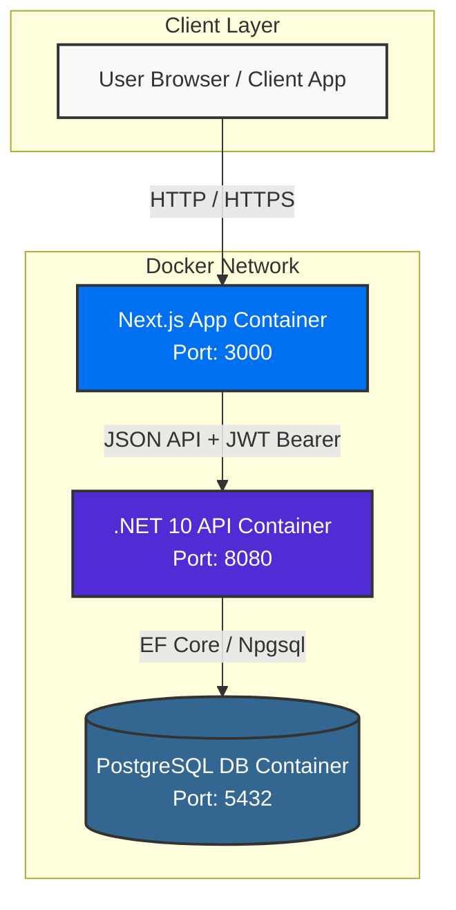
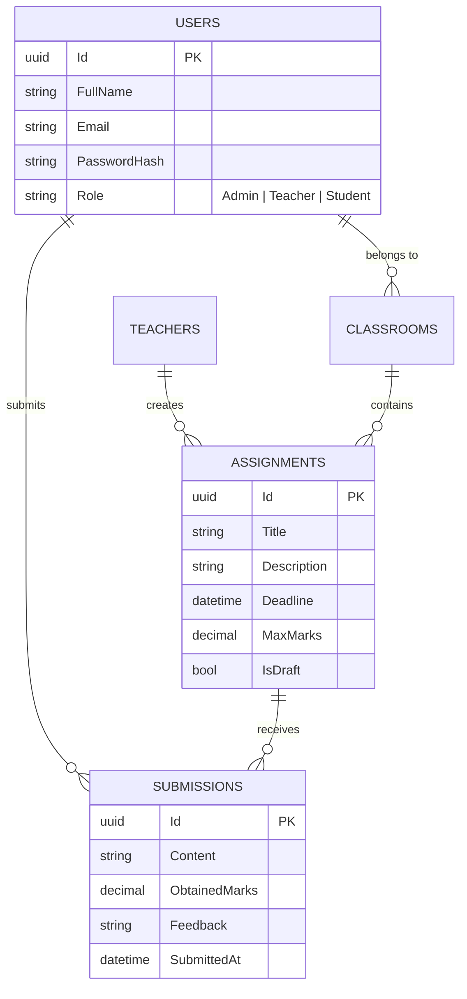
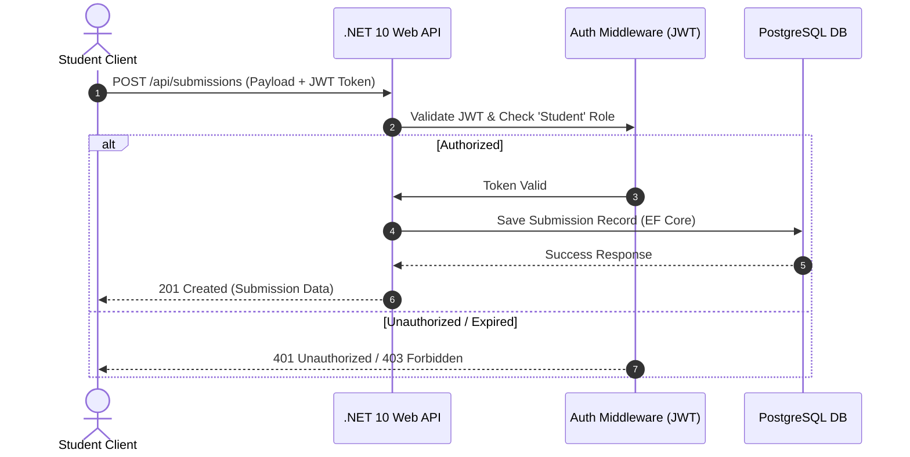

# 📚 Assignment & Submission Management System

A robust, modern full-stack Assignment Management Platform designed for educational institutions. It allows administrators, teachers, and students to manage classrooms, assignments, submissions, and grading seamlessly.

## 🌐 Live Demos & API Documentation

* 🚀 **Live Frontend App:** [https://assignment-sub-system.vercel.app](https://assignment-sub-system.vercel.app)
* 📑 **Live Backend Swagger API Docs:** [https://assignment-sub-system.onrender.com/swagger](https://assignment-sub-system.onrender.com/swagger)

---

## 🌟 Key Features

* **Role-Based Access Control (RBAC):** Distinct dashboards and features for Admin, Teacher, and Student roles.
* **User Management:** Administrators can create, edit, update, or remove users and assign roles/classrooms.
* **Assignment Workflow:** Teachers can post assignments, set deadlines, mark drafts, and grade student submissions.
* **Student Portal:** Students can view assigned tasks, track deadlines, submit work, and view teacher feedback.
* **Modern UI/UX:** Fully responsive, dark-themed, and intuitive user interface built with Tailwind CSS.

---

## 🛠️ Tech Stack

### **Backend**
* **Framework:** .NET 10 Web API
* **Database:** PostgreSQL
* **ORM:** Entity Framework Core
* **Authentication:** JWT (JSON Web Tokens) with BCrypt password hashing

### **Frontend**
* **Framework:** Next.js 14+ (App Router)
* **Language:** TypeScript
* **Styling:** Tailwind CSS, Lucide React / Heroicons

### **DevOps & Containerization**
* **Containerization:** Docker & Docker Compose
* **Server:** Kestrel / Node.js runtime inside Docker

---

## 🏛️ System Architecture & Visualizations

### 1. High-Level Architecture


---

### 2. Entity Relationship Diagram (ERD)


---

### 3. Request Lifecycle & Security Sequence


---

## 🔒 Security & Data Flow Design

* **Stateless Authentication:** Uses JWT (JSON Web Tokens) containing Role claims (Admin, Teacher, Student).
* **Authorization Middleware:** Restricts endpoints based on roles (e.g., Only Teacher role can access Grade Submission endpoints).
* **Environment Isolation:** Sensitive configs like DB Passwords and JWT Secrets are injected dynamically via Docker `.env` variables, keeping `appsettings.json` clean.
* **Data Validation:** Client-side form validation combined with Server-side Data Annotations and DTO Validation.

---

## 🏗️ Project Structure

```text
Assignment_Sub_System/
├── AssignmentSubSystem.API/       # .NET Web API Project
│   ├── Controllers/               # API Endpoints
│   ├── Data/                      # DbContext & Database Initializers
│   ├── Models/                    # Entity Models & DTOs
│   ├── Migrations/                # EF Core Database Migrations
│   ├── Dockerfile                 # Backend Docker Configuration
│   └── appsettings.json           # Template configuration file
│
├── assignmentsub-client/          # Next.js Frontend Application
│   ├── app/                       # App Router Pages (admin, teacher, student)
│   ├── components/                # Reusable UI Components
│   ├── lib/                       # API Clients & Auth Helpers
│   ├── Dockerfile                 # Frontend Docker Configuration
│   └── package.json
├── AssignmentSubSystem.Tests/     # xUnit Automated Unit Tests Project
│   ├── SubmissionReviewTests.cs   # Unit tests for submissions
│   └── UserAuthTests.cs           # Unit tests for authentication logic
│
├── docker-compose.yml             # Orchestration for DB, API, and Frontend
├── .env.example                   # Environment Variables Template
└── README.md                      # Documentation
```

---

## 📥 Project Cloning & Setup Instructions

Follow these steps to clone and run the project on your machine.

### Step 1: Clone the Repository
Open your terminal and run:

```bash
git clone https://github.com/riyad102hossain/Assignment_Sub_System.git
cd Assignment_Sub_System
```

### Step 2: Configure Environment Variables
Create a `.env` file in the root directory by copying the `.env.example` file:

```bash
cp .env.example .env
```
*(The default configuration inside `.env.example` is ready for immediate execution).*

---

## 🚀 How to Run the Project

### Option A: Running with Docker (Recommended - One Click Setup)

Ensure Docker Desktop is installed and running, then execute:

```bash
docker compose up --build -d
```

#### Access Applications:
* 🌐 **Frontend Application:** `http://localhost:3000`
* 📑 **Backend Swagger API Docs:** `http://localhost:8080/swagger`
* 🗄️ **PostgreSQL Database:** `localhost:5432`

---

### Option B: Running Manually (Without Docker)

#### Prerequisites
* .NET 10.0 SDK
* Node.js (v18+)
* PostgreSQL (v15+)

#### 1. Database Setup
Set up local PostgreSQL and update the connection string in `AssignmentSubSystem.API/appsettings.Development.json` (or `appsettings.json`):

```json
"ConnectionStrings": {
  "DefaultConnection": "Host=localhost;Port=5432;Database=AssignmentSystemDb;Username=YOUR_POSTGRES_USER;Password=YOUR_POSTGRES_PASSWORD"
}
```

#### 2. Backend API Setup
Run these commands inside the API directory:

```bash
cd AssignmentSubSystem.API
dotnet restore
dotnet ef database update
dotnet run
```
> Running at: `http://localhost:8080` or `http://localhost:5000`

#### 3. Frontend Client Setup
Open a new terminal and run these commands:

```bash
cd assignmentsub-client
npm install
npm run dev
```
> Running at: `http://localhost:3000`

---

## 🔑 Default Credentials & Role Testing

| Role | Email | Password |
| :--- | :--- | :--- |
| **Admin** | `admin@school.com` | `Admin123` |
| **Teacher** | `teacher@school.com` | `Teacher123` |
| **Student** | `student@school.com` | `Student123` |

---

## 🧹 Stopping and Cleaning Up Docker Services

To stop containers and reset the database volume:

```bash
docker compose down -v
```

---

## 🧪 Running Unit Tests

The solution includes automated unit tests using **xUnit** and **Moq** covering authentication, password hashing, and assignment submission/grade validation logic.

To execute the unit tests, run the following command from the root directory:

```bash
dotnet test AssignmentSubSystem.Tests
```

---

## 💡 Assumptions

* **Submission Deadlines:** Students are restricted from submitting or updating assignments after the specified deadline unless extended by a teacher.
* **File Uploads:** File attachments for assignments/submissions are handled via simple base64/URL streams for demonstration purposes.
* **Database State:** Docker Compose automatically runs migrations and seeds the initial demo data (users, classes) on startup.

---

## ⚠️ Known Limitations

* **Real-time Notifications:** Notifications (e.g., assignment posted, grade published) are not real-time and require page refresh.
* **Email Verification:** Account creation/password recovery does not send real SMTP emails in the current environment.
* **Advanced Analytics:** Detailed performance analytics and graphical reports for admins/teachers are not implemented in the current scope.